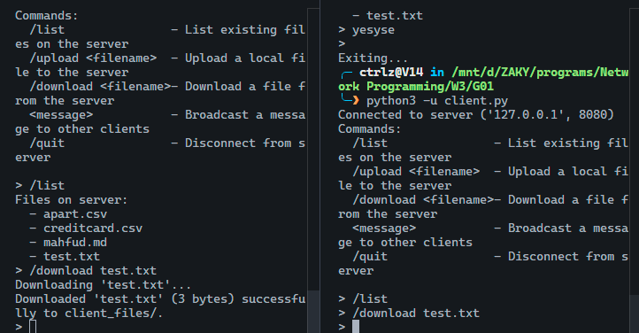
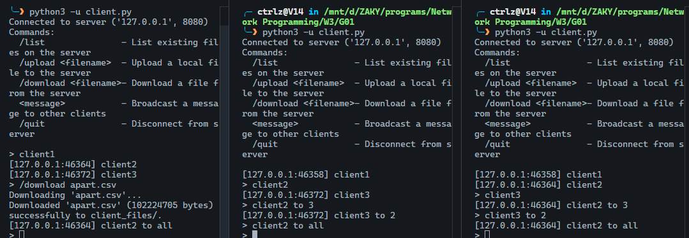
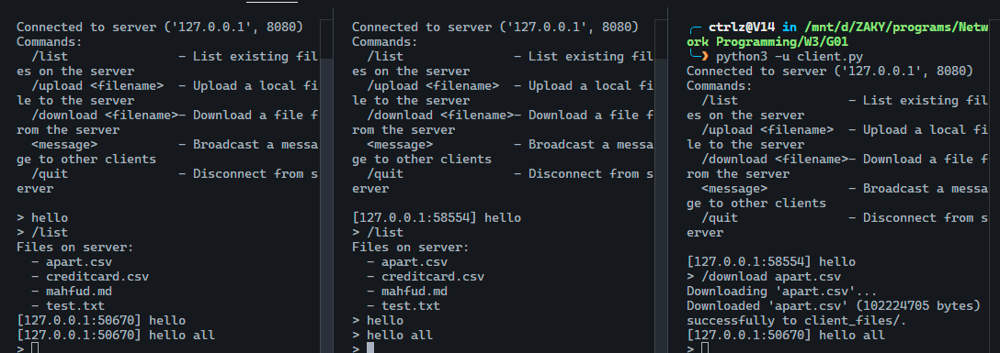
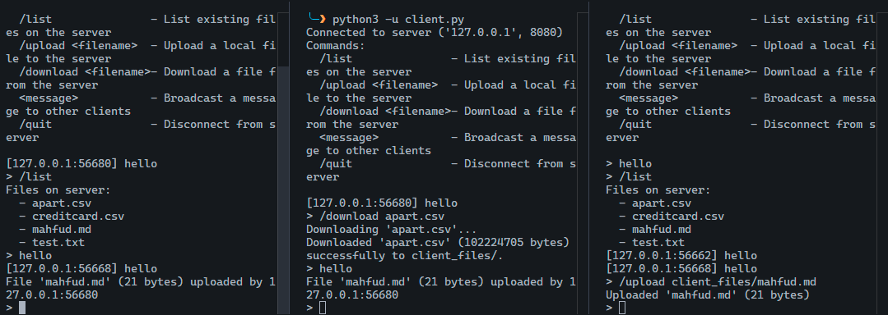

[](https://classroom.github.com/a/mRmkZGKe)
# Network Programming - Assignment G01

## Anggota Kelompok
| Nama                          | NRP        | Kelas |
| ---                           | ---        | ---   |
| Muhammad Quthbi Danish Abqori | 5025241036 | C     |
| Muhammad Zaky Zein            | 5025241148 | C     |

## Link Youtube (Unlisted)
[Demo TCP Servers](https://youtu.be/2OMUo1qupIs)


## Penjelasan Program

### A. Deskripsi Umum
Aplikasi ini adalah program berbasis *Client-Server* menggunakan protokol *TCP Socket* pada Python. Program ini memungkinkan banyak pengguna (klien) untuk terhubung ke satu server pusat guna melakukan pertukaran pesan teks secara *real-time* (*chatting*) dan mentransfer file (*upload* & *download*).

### B. Struktur File & Komponen Utama
#### `utils.py`
 
##### `class ClientState`
Menyimpan status transfer file per-klien (untuk mode *non-blocking*). Memiliki field untuk:
- **Download**: file handle (`dl_file`), sisa byte (`dl_remaining`)
- **Upload**: file handle (`ul_file`), sisa byte (`ul_remaining`), ukuran asli, nama file
 
##### `class TCPFileServer`
 
- `__init__(...)`
Menginisialisasi server: menentukan mode operasi, direktori penyimpanan file (server & klien), alamat TCP, serta dua `set` untuk melacak soket yang sedang dalam proses *upload*/*download*.
 
- `send_message(sock, msg_var)`
Mengirim pesan JSON ke soket dengan format *length-prefixed* dengan 4 byte header (panjang data) + payload JSON UTF-8.
 
- `recv_exact(sock, n)`
Membaca tepat `n` byte dari soket, melakukan loop hingga semua byte terkumpul.
 
- `recv_message(sock)`
Menerima satu pesan lengkap: baca 4 byte header untuk tahu panjang pesan, lalu baca payload-nya dan decode sebagai JSON.
 
- `_broadcast(sender_sock, clients_list, message_dict)`
Helper method untuk mengirim pesan ke semua klien kecuali pengirim, dan melewati klien yang sedang dalam proses *upload*/*download*.
 
- `handle_upload(sock, msg, clients_list, addr, state)`
Router upload: memanggil `_upload_blocking` untuk mode sync/thread, atau `_begin_upload` untuk mode *non-blocking* (*select*/*poll*).
 
- `_upload_blocking(sock, msg, clients_list, addr)`
Menerima file secara sinkron chunk per chunk hingga selesai, lalu broadcast notifikasi ke klien lain.
 
- `_begin_upload(sock, msg, state)`
Membuka file dan menyiapkan state untuk upload non-blocking. Soket ditandai sebagai sedang uploading.
 
- `upload_chunk(sock, state, clients_list)`
Menerima satu chunk data upload. Mengembalikan `True` jika upload selesai, `False` jika masih berlanjut.
 
- `handle_download(sock, msg, addr, state)`
Router download: memanggil `_download_blocking` untuk mode *sync*/*thread*, atau `_begin_download` untuk mode *non-blocking*.
 
- `_download_blocking(sock, msg, addr)`
Mengirim file secara sinkron: kirim header JSON berisi ukuran file, lalu kirim isi file chunk per chunk.
 
- `_begin_download(sock, msg, state)`
Membuka file dan mengirim header JSON, lalu menyiapkan state untuk pengiriman *non-blocking*.
 
- `download_chunk(sock, state)`
Mengirim satu chunk data ke klien. Mengembalikan `True` jika file sudah habis terkirim, `False` jika masih berlanjut.
 
- `handle_client_message(sock, msg, clients_list)`
Menangani pesan umum dari klien:
    - `command: list` — membalas dengan daftar file di direktori server
    - `broadcast` — meneruskan pesan ke semua klien lain
    - Selain itu — membalas dengan error "Unknown command"

#### 2. `client.py`
Program ini akan dijalankan oleh klien (*endpoint*). Ia akan terhubung ke server dan mengirimkan pesan secara *broadcast* dan menjalankan perintah-perintah yang ada. Program ini menggunakan fitur *threading* untuk memungkinkan klien menerima dan mengirim pesan secara bersamaan tanpa membuat program menjadi *freeze*.
```py
threading.Thread(target=recv_loop, args=(sock, server), daemon=True).start()
```
Selain itu client mengimplementasikan `safe_print(content)` untuk mencetak pesan ke terminal tanpa mengganggu input yang sedang diketik *user*. Menggunakan escape ANSI untuk menghapus baris input sementara, mencetak pesan, lalu menulis ulang prompt `>` beserta teks yang sudah diketik.

#### 3. Server Implementations
Terdapat empat versi dari server yang dibuat, yaitu `server-sync.py`, `server-thread.py`, `server-select.py`, dan `server-poll.py`. Keempatnya menggunakan logika inti dari `utils.py`, namun memiliki cara kerja yang berbeda.

### C. Perbandingan Arsitektur
Walaupun keempatnya menggunakan logika inti dari `utils.py`, masing-masing server punya cara kerja yang berbeda. Berikut adalah penjelasannya.

#### 1. `server-sync.py`
Server ini berjalan secara *blocking* yang artinya dia hanya bisa melayani satu *client* dalam satu waktu karena server harus menunggu satu proses selesai sebelum mulai proses selanjutnya.

Perhatikan dua *netsted loop* `while` berikut:
```py
while True: # OUTER LOOP: Menunggu koneksi baru
        try:
            # Server akan berhenti hingga ada klien yang terhubung
            client_sock, addr = server_sock.accept() 
            clients = [client_sock]
            
            while True: # INNER LOOP: Berkomunikasi dengan klien yang terhubung
                # Server akan berhenti hingga ada pesan dari klien
                msg = recv_message(client_sock) 
                if not msg:
                    break # Berhenti hanya ketika klien memutuskan koneksi
                handle_client_message(client_sock, msg, clients)
```
Misalnya saja Klien A terhubung, server akan masuk melewati `accept()` dan masuk ke *inner loop*. Server akan terus berada di *inner loop* dan mendengarkan Klien A hingga dia memutuskan koneksi. Jika ada Klien B yang berjalan di waktu yang sama, akan muncul `Connected to server 127.0.0.1:8080` di terminal Klien B. Hal ini disebabkan karena OS secara otomatis menerima koneksi TCP dan menempatkan Klien B dalam "ruang tunggu" (`server_sock.listen(5)`). Meski begitu, Klien B tetap akan terblokir di `accept()` karena server masih terjebak di *inner loop* hingga Klien A memutuskan koneksi. 

Akibatnya adalah ketika Klien A mengirim pesan *broadcast*, dia akan berbicara pada ruangan kosong karena tidak ada klien lain yang bisa terhubung ke server dalam waktu yang sama. Sedangkan jika Klien B mengirim pesan, pesan itu akan tersalurkan ke buffer RAM server. Begitu Klien A memutuskan koneksi, server akan keluar dari *inner loop* dan masuk ke *outer loop* lagi dan mengenai `accept()`. Saat itulah server akan menangani Klien B dan memproses pesan yang dikirim Klien B sebelumnya.

#### 2. `server-thread.py`
Server ini bekerja dengan cara asinkronus sehingga dapat menangani banyak klien dalam waktu yang bersamaaan. Server ini menggunakan *thread* untuk menangani setiap klien yang terhubung. Berbeda dengan `server-sync.py` sebelumnya, server ini tidak akan memblokir klient yang terhubung karena begitu ia mengenai `accept()` ia akan membuat *thread* baru untuk menangani klien tersebut dan langsung kembali ke `accept()` untuk menunggu klien berikutnya. Hal ini membuat server dapat menangani banyak klien dalam waktu yang bersamaan dan efektif untuk berkomunikasi antar klien menggunakan *broadcast*.

```py
while True:
        try:
            client_sock, addr = server_sock.accept() # Server menerima klien baru
            threading.Thread(target=client_thread, args=(client_sock, addr, server), daemon=True).start() # Server akan membuat thread baru untuk menangani klien tersebut

            # Server kembali loop ke atas untuk menerima klien berikutnya
```

#### 3. `server-select.py`
Server ini menggunakan pendekatan *I/O multiplexing* dengan fungsi `select()`, sehingga satu *thread* tunggal mampu memantau banyak soket sekaligus tanpa perlu memblokir eksekusi. Kuncinya ada pada dua list dari `select()`, rlist (soket yang dipantau untuk dibaca) dan wlist (soket yang dipantau untuk ditulis). Setiap iterasi, `select()` akan mengembalikan soket mana saja yang benar-benar siap sehingga server tidak perlu menunggu.

Pada `server-select.py`:
```python
rlist = [server_sock]  # Awalnya hanya ada server socket
wlist = []             # Belum ada yang perlu dikirim

while True:
    # select() memblokir hingga minimal satu soket siap
    readable, writable, exceptional = select.select(rlist, wlist, rlist)

    for s in readable:
        if s is server_sock:
            # Ada koneksi baru yang terhubung
            client_sock, addr = s.accept()
            client_sock.setblocking(False)
            rlist.append(client_sock)        # Daftarkan klien baru untuk dipantau
            states[client_sock] = ClientState()
            continue

        # Soket klien siap dibaca, proses message
        if s in server.uploading:
            server.upload_chunk(s, state, current_clients)  # Lanjutkan upload
        else:
            msg = server.recv_message(s)
            if msg_type == "command" and msg.get("cmd") == "download":
                started = server.handle_download(s, msg, addr=None, state=state)
                if started:
                    wlist.append(s)  # Tambahkan ke wlist agar POLLOUT terpantau

    for s in writable:
        # Soket siap ditulis,  kirim chunk berikutnya
        done = server.download_chunk(s, state)
        if done:
            wlist.remove(s)  # Selesai, hapus dari wlist
```

Konsep pentingnya ada pada perpindahan soket antara rlist dan wlist. Saat klien meminta download, soketnya dimasukkan ke wlist. Setiap iterasi berikutnya, `select()` akan menyimpan soket itu di writable selama buffer OS siap menerima data, dan server mengirim satu chunk file. Begitu file habis terkirim, soket dikeluarkan dari wlist dan kembali hanya dipantau di rlist. Dengan cara ini, pengiriman file besar tidak memblokir klien lain sama sekali karena semua terjadi secara bertahap di satu event loop yang sama.

#### 4. `server-poll.py`
Server ini secara konsep identik dengan `server-select.py` keduanya menggunakan *I/O multiplexing* dalam satu *thread*, namun menggunakan `poll()` sebagai pengganti `select()`. 
Pada `select()`, setiap iterasi kita menyerahkan ulang seluruh daftar `rlist` dan `wlist` ke OS untuk diperiksa. Pada `poll()`, kita mendaftarkan soket *satu kali* ke objek `poller`, lalu cukup mengubah *flag* event-nya saat dibutuhkan:
```py
poller = select.poll()
poller.register(server_sock.fileno(), POLLIN)  # Daftarkan server socket sekali saja
 
fd_to_sock = {server_sock.fileno(): server_sock}  # Mapping fd ke socket
 
while True:
    events = poller.poll()  # Memblokir hingga ada event dan mengembalikan list (fd, event)
 
    for fd, event in events:
        s = fd_to_sock.get(fd)
 
        if event & POLLIN:
            if s is server_sock:
                client_sock, addr = s.accept()
                cfd = client_sock.fileno()
                fd_to_sock[cfd] = client_sock
                states[client_sock] = ClientState()
                poller.register(cfd, POLLIN | POLLERR)  # Daftarkan klien baru
                continue

            if msg_type == "command" and msg.get("cmd") == "download":
                started = server.handle_download(s, msg, addr=None, state=state)
                if started:
                    poller.modify(fd, POLLIN | POLLOUT | POLLERR)  # Aktifkan POLLOUT
 
        elif event & POLLOUT:
            done = server.download_chunk(s, state)
            if done:
                poller.modify(fd, POLLIN | POLLERR)  # Matikan POLLOUT setelah selesai
```

Tidak seperti pada `server-select.py` yang memindahkan soket antar daftar seperti di `select`, di sini kita cukup memanggil `poller.modify(fd, ...)` untuk mengubah *flag* event yang dipantau.

### D. Fitur & Perintah Klien
* `/list` - Meminta server mengirimkan daftar file yang ada di folder `server_files`
* `/upload <filename>` - Mengirimkan file yang diminta ke server
* `/download <filename>` - Meminta Server mengirimkan byte-stream file untuk disimpan ke folder `client_files`
* `<message>` - Mengirimkan pesan ke server
* `/quit` - Memutuskan koneksi dari server

## Screenshot Hasil

#### 1. `server-sync.py`

hanya ada satu client yang dapat terhubung ke server pada satu waktu.

#### 2. `server-thread.py`


#### 3. `server-select.py`


#### 4. `server-poll.py`
